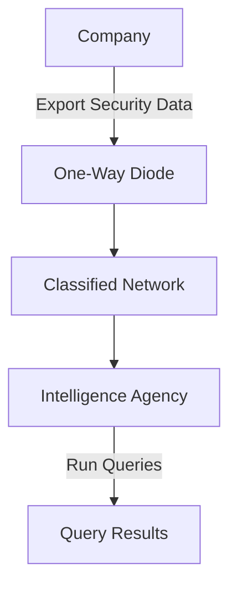
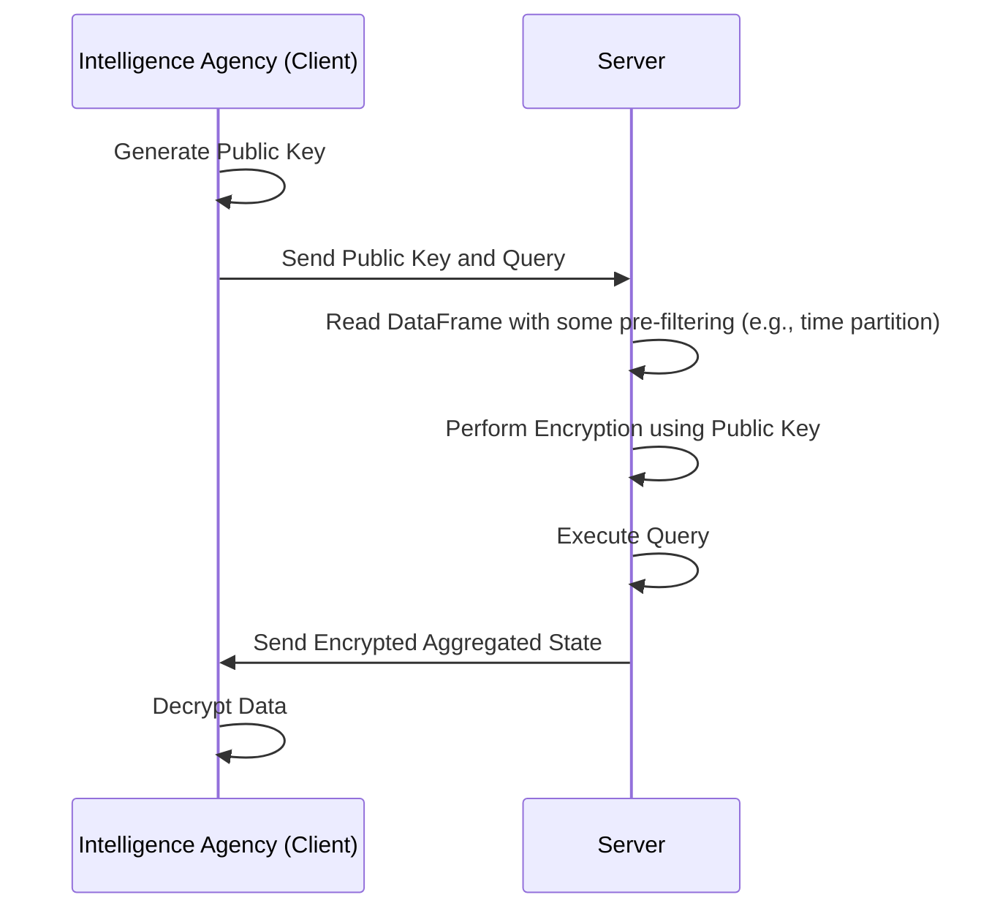

# iocz
The initial goal of this project was to enable detection queries on encrypted data using backend-agnostic APIs, such as Apache Spark, Snowflake, BigQuery, DuckDB, Polars, and Theseus, facilitated by the Ibis Python DataFrame.


## Background 
Cyber threat detection and response at scale typically involve collecting logs in a SIEM like Splunk or Elastic (traditional) or in a cloud-native warehouse or object store (modern). SQL or DataFrame APIs are used to build and execute queries. Detection rules for known bad or suspicious behavior are expressed as queries, such as the following example using Snowflake's SQL dialect from Panther's repository:

```sql
 SELECT
    *
  FROM
    crowdstrike_processrollup2
  WHERE
    commandline LIKE ANY (
      '%/Users/%/Library/Application Support/Google/Chrome/Default/Login Data%',
      ...
      '%key4.db%',
      '%key3.db%',
      '%logins.json%',
      '%cookies.sqlite%'
    )
    /*
    -- allowlist of applications
    and imagefilename NOT IN (
      '/bin/rm'
    )
    */
    and p_occurs_since('1 day')
```
These queries can be complex, joining multiple raw log sources or external data tables to enrich the logs, or simple, such as counting all instances where a process with a specific hash was executed.

Certain critical companies (energy, banking, public infra) often send data to government agencies that have classified detection rules, such as a list of Windows PE hash values or domain names currently used by APTs. These must never be shared.

Below is a simple flow chart illustrating a one-way data diode to ensure that traffic flows in only one direction.


## DataFrames
Instead of using SQL directly, we can use the Ibis DataFrame library to build backend-agnostic queries that run on multiple systems.

For example, suppose we have a detection query looking through security logs for evidence of an intrusion, such as a process with a specific hash value being executed in our environment. Typically, these logs are stored in S3 or ADSL using file formats like Iceberg or Delta Lake.

Here's a simple detection expressed using PySpark that generates a query to read a table, transform columns (to lowercase), and look for a specific hash value within a time period:

```python
events = (
    spark.read_table("db.process_table_name")
         .select(col("p_date"), lower(col("TargetProcessSHA256")))
         .where(col("p_date") > "2024-05-13")
         .where(col("TargetProcessSHA256") == "some_value")
         # .... more conditions here
)

```

Using ibis, you can create DataFrame queries like this, and it will produce SQL for whatever backend you're working with (e.g., Snowflake, Postgres). This allows you to execute the same query on multiple systems:

- DuckDB (small datasets)
- Apache Spark (medium)
- Theseus (huge)

When working with government agencies that can't share classified queries, the idea is to use an FHE DataFrame instead so that we have a similar 

As of now only fhe unsigned 256 bit matching is implemented as a PoC using basic dataframe api.


Here is an example of how it looks in Rust.

```rust
let mut df = FheDataFrame::read_csv("process_logs.csv", &public_key).unwrap();


 // now we are builing the query to look for a specific hash value
 let ioc_hash_value = df.to_fhe(
"027cc450ef5f8c5f653329641ec1fed91f694e0d229928963b30f6b0d7d3a745",
 );


 let counts = df.filter(col("TargetProcessSHA256").eq(lit(ioc_hash_value)))
     .count();


 // this is the result we are returning to the client
 let c: u32 = counts.decrypt(&client_key);
```



### Improvements 

It's likely better to build on top of Polars and add a method to encrypt certain columns and column names, then it would also be easier to create the Python bindings for needed for ibis to work.
