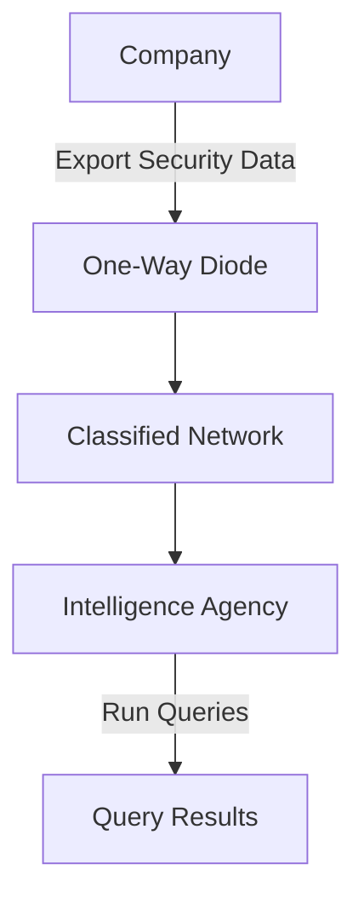
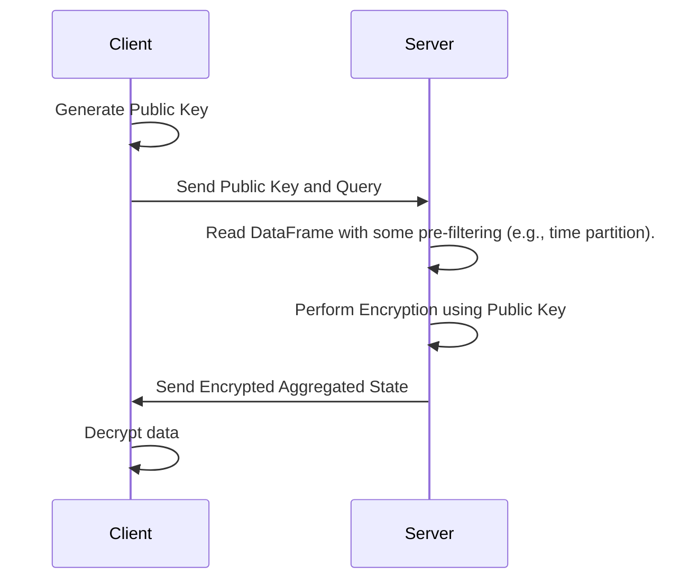

# iocz

The original goal of this project was to create a way to express detection queries on encrypted data using backend-agnostic APIs (e.g., Apache Spark, Snowflake, BigQuery, DuckDB, Polars, Theseus) like those provided by the Ibis Python DataFrame.


## Background 
The way (cyber) threat detection and response is done at scale is either to collect logs in a SIEM like Splunk or Elastic (traditional) or a in cloud native warehouse or object store (modern) and use SQL or DataFrame API to build and execute queries. Detection rules that look for know bad or suspicious behaviour are then expressed as queries, e.g., using Snowflake's SQL dialect (from panther's repo):

```sql
 SELECT
    *
  FROM
    crowdstrike_processrollup2
  WHERE
    commandline LIKE ANY (
      '%/Users/%/Library/Application Support/Google/Chrome/Default/Login Data%',
      ...
      '%key4.db%',
      '%key3.db%',
      '%logins.json%',
      '%cookies.sqlite%'
    )
    /*
    -- allowlist of applications
    and imagefilename NOT IN (
      '/bin/rm'
    )
    */
    and p_occurs_since('1 day')
```
These queries can be quite complex and join together multiple raw log sources or external data tables that enrich the logs or they can be simple matches such count all instances where a process with a specific hash was executed. 

Certain critical companies often send data to goverment agencies who have classified detection rules, e.g,. Windows PE hash values or domain names that are currently used by APT's. These must never be shared. 

Here is a simple flow chart where a one-way data diode to ensure that traffic only flows one way.



## DataFrames

Instead of using SQL directly we can use the dataframe library ibis to build backend agnostic queries that run one multiple system.

For example, suppose we have a detection query looking through security logs for evidence of an intrusion, such as a process with a specific hash value being executed in our environment. Typically, these logs are stored in S3 or ADSL using file formats like Iceberg or Delta Lake.

Here's a simple detection expressed using PySpark that generates a query to read a table, transform columns (to lowercase), and look for a specific hash value within a time period:

```python
events = (
    spark.read_table("db.process_table_name")
         .select(col("p_date"), lower(col("TargetProcessSHA256")))
         .where(col("p_date") > "2024-05-13")
         .where(col("TargetProcessSHA256") == "some_value")
         # .... more conditions here
)

```

Using ibis, you can create DataFrame queries like this, and it will produce SQL for whatever backend you're working with (e.g., Snowflake, Postgres). This allows you to execute the same query on multiple systems:

- DuckDB (small datasets)
- Apache Spark (medium)
- Theseus (huge)

When working with government agencies that can't share classified queries, the idea is to use an FHE DataFrame instead so that we have a similar 

As of now only fhe unsigned 256 bit matching is implemented as a PoC using basic dataframe api.


Here is an example of how it looks in Rust.

```rust
let mut df = FheDataFrame::read_csv("process_logs.csv", &public_key).unwrap();


 // now we are builing the query to look for a specific hash value
 let ioc_hash_value = df.to_fhe(
"027cc450ef5f8c5f653329641ec1fed91f694e0d229928963b30f6b0d7d3a745",
 );


 let counts = df.filter(col("TargetProcessSHA256").eq(lit(ioc_hash_value)))
     .count();


 // this is the result we are returning to the client
 let c: u32 = counts.decrypt(&client_key);
```

As improvement it's probably better to build on top of polars and the add a method to encrypt certain columns (and column names).

